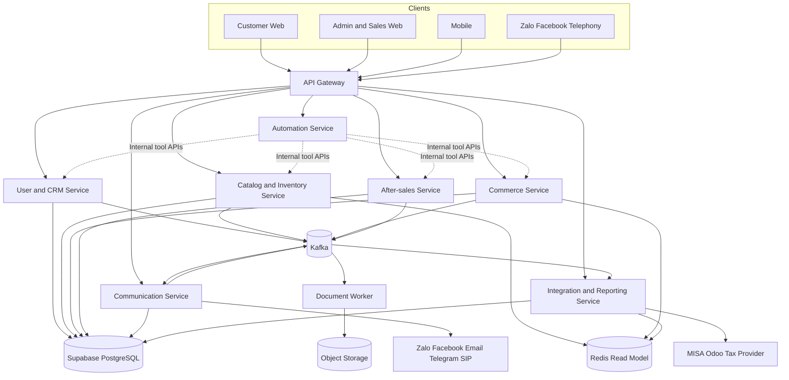
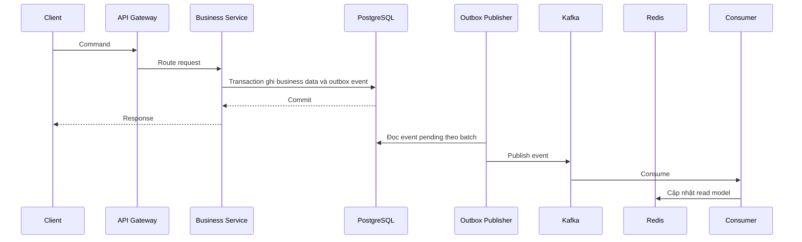
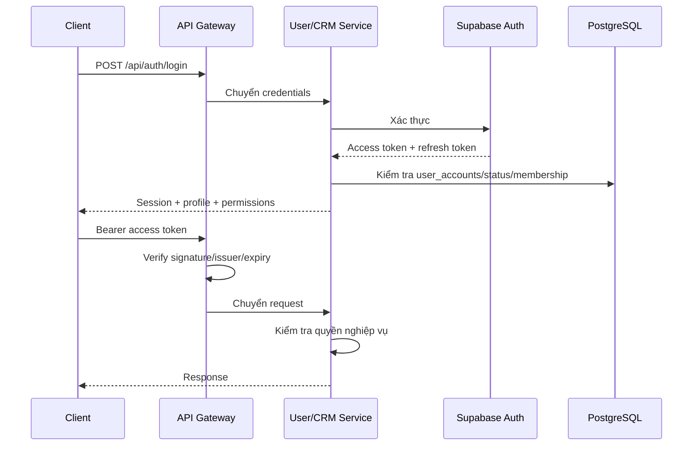

# Kiến trúc hệ thống Phúc Thành Audio

## 1. Mục tiêu

Hệ thống được thiết kế theo **service-based architecture**:

- Client chỉ gọi một địa chỉ qua API Gateway.
- Mỗi service là một ứng dụng Spring Boot, chạy cổng và tiến trình riêng.
- Một service lỗi không làm dừng toàn bộ hệ thống.
- Các service dùng chung Supabase PostgreSQL trong giai đoạn đầu, nhưng mỗi bảng có một service sở hữu rõ ràng.
- Service được chia theo năng lực nghiệp vụ, không chia một bảng hoặc một màn hình thành một service.
- Các module cần cùng transaction được đặt trong cùng service.
- REST dùng cho yêu cầu cần phản hồi ngay.
- Kafka dùng cho công việc bất đồng bộ.
- Redis dùng cho dữ liệu đọc nhanh theo CQRS.
- Hệ thống bên ngoài chỉ được truy cập qua Integration/Communication Adapter, không ghi thẳng vào bảng nghiệp vụ.

Đây là service-based architecture với shared database, chưa phải microservices theo mô hình database-per-service.

## 2. Công nghệ lõi đã chốt

| Thành phần | Công nghệ |
|---|---|
| Backend | Java, Spring Boot, Spring Data JPA |
| API Gateway | Spring Cloud Gateway |
| Xác thực | Spring Security, JWT |
| Database nguồn sự thật | Supabase PostgreSQL |
| Cache/read model | Redis |
| Message broker | Apache Kafka |
| Giao dịch và sự kiện | Transactional Outbox Pattern |
| Job theo lịch | Spring Scheduler; nâng lên Quartz khi cần lịch phức tạp |
| Sinh tài liệu | Document Worker, DOCX template, docx4j, LibreOffice headless |
| Lưu file | Supabase Storage qua S3-compatible adapter; có thể đổi sang AWS S3/MinIO |
| AI orchestration | Automation Service gọi mô hình AI qua provider adapter |
| AI Voice | Communication Service, Call Center module, SIP provider, realtime voice engine |
| Giám sát | Spring Boot Actuator, Prometheus, Grafana, OpenTelemetry |
| Đóng gói | Maven, Docker, Docker Compose |

## 3. Những công nghệ cũ được thay thế

| Cách ghi cũ | Thay bằng | Ghi chú |
|---|---|---|
| Airtable lưu dữ liệu | Supabase PostgreSQL | Database nghiệp vụ chính |
| Airtable tra sản phẩm/giá | Catalog/Inventory Service + Redis + PostgreSQL | Giá chính thức luôn lấy từ backend |
| Airtable Pipeline | Commerce Service + bảng `leads` | Giao diện Kanban đọc qua API |
| Airtable Dashboard | Integration/Reporting Service + dashboard web | Không dùng Airtable làm hệ thống lõi |
| Google Sheets lưu giao dịch | PostgreSQL + chức năng export XLSX | Sheet chỉ là đầu ra tùy chọn |
| OpenClaw điều khiển toàn bộ | Automation Service | AI không được ghi database trực tiếp |
| Zen tra sản phẩm | Product Matching trong Automation và Catalog/Inventory Service | Redis hỗ trợ tìm nhanh |
| Cron OpenClaw | Spring Scheduler hoặc Quartz | Phù hợp nhắc nợ, sinh nhật, hết bảo hành |
| Google Docs là nơi quản lý dữ liệu | Document Worker | Template có phiên bản; dữ liệu nằm trong PostgreSQL |
| Google Drive là kho file bắt buộc | S3-compatible/Supabase Storage | Có thể giữ Drive dưới dạng adapter nếu khách yêu cầu |
| Telegram là màn hình quản trị | Dashboard web + Communication Service | Telegram chỉ là một kênh thông báo |
| MISA/Odoo ghi thẳng dữ liệu lõi | Integration/Reporting Service | Đồng bộ qua API, có log và idempotency |
| Zalo/Facebook xử lý logic nghiệp vụ | Channel Adapter | Chỉ nhận/gửi tin; nghiệp vụ nằm trong service |

Không còn `Airtable`, `OpenClaw`, `Zen`, `Google Sheets` trong luồng nghiệp vụ lõi. Nếu vẫn dùng, chúng chỉ là adapter tùy chọn và có thể thay mà không sửa nghiệp vụ.

## 4. Sơ đồ tổng thể



## 5. API Gateway và giao tiếp service

Client chỉ biết một base URL:

```text
https://api.phucthanhaudio.vn/api
```

Route dự kiến:

```text
/api/auth/**         -> user-crm-service
/api/customers/**    -> user-crm-service
/api/staff/**        -> user-crm-service
/api/products/**     -> catalog-inventory-service
/api/inventory/**    -> catalog-inventory-service
/api/leads/**        -> commerce-service
/api/quotations/**   -> commerce-service
/api/contracts/**    -> commerce-service
/api/invoices/**     -> commerce-service
/api/payments/**     -> commerce-service
/api/repairs/**      -> aftersales-service
/api/reminders/**    -> aftersales-service
/api/automation/**   -> automation-service
/api/messages/**     -> communication-service
/api/calls/**        -> communication-service
/api/reports/**      -> integration-reporting-service
```

Quy tắc giao tiếp:

- Client gọi service qua API Gateway.
- API Gateway chỉ xử lý routing, xác thực sơ bộ, CORS, rate limit, timeout và correlation ID; không chứa nghiệp vụ.
- Service gọi service trực tiếp bằng REST khi cần kết quả ngay.
- Service phát sự kiện Kafka khi không cần chờ xử lý hoàn thành.
- Không bắt service nội bộ đi vòng qua API Gateway.
- Mỗi service vẫn kiểm tra JWT và quyền truy cập.
- Worker như Document Worker không có public API; worker chỉ nhận Kafka event.

## 6. Shared libraries

Tạo một module `shared-kernel` có phạm vi kỹ thuật hẹp. Root Maven parent chịu
trách nhiệm quản lý phiên bản dependency; `shared-kernel` chỉ chứa contract và
cấu hình thật sự được nhiều service dùng chung:

```text
shared-kernel
|-- security
|-- AuthenticatedUser
|-- SupabaseJwtAuthenticationConverter
|-- SharedServletSecurityConfiguration
|-- web
|-- ApiError
|-- BusinessException
|-- CorrelationIds
|-- event
|-- EventEnvelope
|-- storage
|-- ObjectStoragePort
|-- StoredObject
`-- cấu hình nền PostgreSQL, Redis, Kafka, JWT và Actuator
```

Không đưa `Customer`, `Product`, `Lead`, `Quotation`, JPA entity, repository,
DTO nghiệp vụ hoặc business service vào `shared-kernel`. Mỗi service tự sở hữu
domain model của mình. Không service nào được truy cập repository của service
khác thông qua module dùng chung.

## 7. Quyền sở hữu bảng

| Service | Bảng sở hữu |
|---|---|
| User and CRM Service | `customers`, `staff_members`, `user_accounts`, `customer_memberships`, `auth_audit_logs` |
| Catalog and Inventory Service | `products`, `product_images`, `inventory_movements`, `stock_alerts` |
| Commerce Service | `leads`, `lead_items`, `quotations`, `quotation_items`, `contracts`, `invoices`, `invoice_items`, `payment_records`; sau này thêm `deliveries` |
| After-sales Service | `customer_assets`, `repair_requests`, `customer_reminders` |
| Communication Service | `call_logs`; sau này thêm `message_logs` |
| Integration and Reporting Service | `kpi_snapshots`; sau này thêm `integration_logs` |
| Document Worker | Sau này sở hữu `generated_documents`, `document_templates` |
| Automation Service | Không ghi trực tiếp bảng nghiệp vụ; gọi internal tool API |
| Hạ tầng sự kiện | `outbox_events`, `processed_events` |

Các bảng chưa có SQL được ghi là phase database tiếp theo, không được tự giả định là đã chạy trên Supabase.

`customer_reminders.invoice_id` cho phép Scheduler nhắc công nợ trực tiếp theo hóa đơn, kể cả hóa đơn bán lẻ không có hợp đồng.

Các SQL hiện tại cấp quyền cho `service_role` để triển khai MVP. Trước production nên tạo database role riêng cho từng service, chỉ grant quyền ghi trên các bảng service đó sở hữu; tuyệt đối không đưa credential backend vào frontend.

### Lưu ảnh sản phẩm

- Dùng bucket public `product-media` của Supabase Storage để CDN có thể phục vụ ảnh catalog nhanh.
- Object key chuẩn: `products/{product_id}/{uuid}.{ext}`; không dùng tên file người dùng làm object key.
- Bảng `product_images` lưu metadata, thứ tự và ảnh chính; không lưu binary và không lưu URL CDN cố định.
- Catalog/Inventory Service là nơi duy nhất upload, đổi ảnh chính, archive metadata và yêu cầu xóa object.
- Khi đổi ảnh chính, service hạ ảnh chính cũ rồi ghi ảnh mới trong cùng transaction; nếu ghi database lỗi thì xóa object vừa upload.
- Frontend không giữ service key hoặc S3 access key. Upload từ trang admin đi qua backend.
- Chỉ nhận JPEG, PNG, WebP và AVIF, tối đa 10 MB; backend vẫn phải kiểm tra nội dung thực của file.
- Bucket tài liệu hợp đồng, báo giá và hóa đơn phải là private; Document Worker cấp signed URL khi cần tải.
- Backend dùng `ObjectStoragePort`, còn Supabase Storage là adapter đầu tiên. Chuyển sang AWS S3 hoặc MinIO không làm đổi domain service.

### Module bên trong service

```text
commerce-service
|-- lead
|-- quotation
|-- contract
|-- delivery
|-- invoice
`-- payment

catalog-inventory-service
|-- product
|-- pricing
|-- search
|-- inventory
`-- stock-alert

aftersales-service
|-- customer-asset
|-- warranty
|-- repair
`-- reminder

communication-service
|-- notification
|-- message
`-- call-center
```

Các module trong cùng service có thể dùng chung transaction. Giao tiếp ra ngoài service phải qua public API hoặc event, không truy cập repository của service khác.

Commerce lấy customer/product qua API nội bộ và lưu snapshot cần thiết vào chứng từ. Tránh chuỗi gọi đồng bộ dài; PDF, thông báo, KPI và đồng bộ hệ thống ngoài đều chuyển sang Kafka.

Integration/Reporting Service được đọc các bảng nghiệp vụ ở chế độ read-only trong MVP để lập báo cáo, nhưng không được ghi bảng của service khác. Khi hệ thống lớn hơn, reporting chuyển sang projection được dựng từ Kafka event.

## 8. CQRS, Redis, Kafka và Outbox



Redis key gợi ý:

```text
product:{id}
product:sku:{sku}
products:active
products:low-stock
stock:{product_id}
customer:{id}
lead:kanban:{staff_id}
```

Kafka event gợi ý:

```text
lead.created.v1
lead.scored.v1
quotation.created.v1
quotation.approved.v1
quotation.document-requested.v1
quotation.document-generated.v1
contract.created.v1
contract.document-requested.v1
contract.document-generated.v1
invoice.issued.v1
payment.recorded.v1
repair.created.v1
repair.completed.v1
inventory.movement-created.v1
product.stock-changed.v1
stock.alert-created.v1
customer.reminder-due.v1
call.completed.v1
kpi.snapshot-generated.v1
```

Consumer phải idempotent theo `event_id` vì Kafka có thể giao lại cùng một message. Dùng aggregate ID làm Kafka key để giữ thứ tự event của cùng một lead, hợp đồng, hóa đơn hoặc sản phẩm.

### Quyết định về Debezium

Phase đầu chưa dùng Debezium.

- Service ghi dữ liệu nghiệp vụ và `outbox_events` trong cùng transaction.
- Spring Outbox Publisher đọc theo batch bằng `FOR UPDATE SKIP LOCKED`.
- Scheduler/Quartz xử lý nghiệp vụ dựa trên thời gian.
- Debezium chỉ cân nhắc khi có lưu lượng ghi rất lớn hoặc nhiều hệ thống ngoài ghi trực tiếp PostgreSQL.

Debezium không tự phát hiện ngày đến hạn nếu bản ghi không thay đổi. Nhắc nợ, sinh nhật và hết bảo hành vẫn cần Scheduler.

## 9. Tám nghiệp vụ đã chuẩn hóa

### 9.1. Tạo hợp đồng tự động

Đầu vào:

- Mã số thuế, số điện thoại, số tiền, điều khoản, báo giá đã duyệt.

Luồng:

```text
Sales gửi yêu cầu
-> Commerce Contract module kiểm tra báo giá và khách hàng
-> Tax Lookup Adapter lấy và chuẩn hóa thông tin doanh nghiệp
-> User/CRM Service cập nhật hồ sơ khách hàng
-> Commerce Contract module tạo hợp đồng
-> Kafka phát contract.document-requested.v1
-> Document Worker điền DOCX template và xuất PDF
-> Lưu file vào Object Storage
-> Document Worker phát contract.document-generated.v1
-> Commerce Service cập nhật link và trạng thái tài liệu
-> Communication Service nhận event và gửi khách hàng/thông báo nội bộ
```

Đầu ra:

- Hợp đồng DOCX/PDF, link file, lịch sử gửi.

### 9.2. Báo giá tự động theo quy trình ISO

Đầu vào:

- Danh sách sản phẩm, số lượng, yêu cầu kỹ thuật, thông tin khách hàng.

Luồng:

```text
Nhận yêu cầu từ Web/Zalo/Facebook/Call
-> Commerce Lead module tạo lead
-> Automation Service trích xuất nhu cầu có cấu trúc
-> Catalog/Inventory Service match sản phẩm
-> Lấy giá chính thức từ PostgreSQL/Redis
-> Commerce Quotation module tạo quotation và quotation_items snapshot
-> Duyệt nếu vượt ngưỡng giảm giá
-> Kafka phát quotation.document-requested.v1
-> Document Worker dùng template đã kiểm soát phiên bản
-> Xuất PDF và lưu Object Storage
-> Document Worker phát quotation.document-generated.v1
-> Commerce Service cập nhật link và trạng thái
-> Communication Service gửi khách hàng
```

Đầu ra:

- Báo giá PDF, phiên bản tài liệu, link xem, trạng thái duyệt và gửi.

### 9.3. Pipeline bán hàng

Đầu vào:

- Lead từ Web, Zalo, Facebook, cuộc gọi, giỏ hàng bỏ dở hoặc nguồn thầu.

Luồng:

```text
Communication Service nhận lead
-> Commerce Lead module chống trùng và tạo lead
-> Automation Service chấm điểm gợi ý
-> Sales phân công người phụ trách
-> Theo dõi stage trên Kanban
-> Báo giá
-> Đàm phán
-> Hợp đồng
-> Giao hàng
-> Hóa đơn và thanh toán
-> Closed hoặc Lost
```

Đầu ra:

- Pipeline, lịch sử xử lý, tỷ lệ chuyển đổi, doanh thu dự kiến.

### 9.4. CSKH tự động

Đầu vào:

- Hạn thanh toán, hạn bảo hành, ngày sinh, lịch follow-up.

Luồng:

```text
After-sales Reminder module tạo customer_reminders
-> Scheduler lấy reminder đến hạn
-> Ghi outbox event customer.reminder-due
-> Kafka
-> Communication Service gửi đúng kênh
-> Ghi message_logs và kết quả gửi
```

Đầu ra:

- Tin nhắn cho khách hàng, trạng thái gửi, lịch sử CSKH.

### 9.5. Bảo hành và sửa chữa

Đầu vào:

- Yêu cầu bảo hành/sửa chữa từ Web, Zalo, Facebook hoặc cuộc gọi.

Luồng:

```text
After-sales Repair module xác định khách hàng và thiết bị
-> Tạo repair_request
-> Phân công kỹ thuật viên
-> Thông báo nội bộ
-> Kỹ thuật viên cập nhật chẩn đoán, chi phí và trạng thái
-> Hoàn thành
-> Communication Service thông báo khách hàng
```

Đầu ra:

- Phiếu sửa chữa, lịch sử trạng thái, linh kiện/chi phí và thông báo hoàn thành.

### 9.6. Tồn kho và cảnh báo

Đầu vào:

- Phiếu nhập, xuất, điều chỉnh, trả hàng, giao hàng và linh kiện sửa chữa.

Luồng:

```text
Catalog/Inventory Stock module tạo inventory_movement
-> Cập nhật products.stock_quantity trong cùng transaction
-> Phát product.stock-changed
-> Cập nhật Redis
-> So sánh tồn tối thiểu
-> Tạo stock_alert nếu thiếu hàng
-> Communication Service gửi cảnh báo
```

Đầu ra:

- Tồn hiện tại, sổ biến động kho, giá trị tồn và cảnh báo.

### 9.7. KPI Dashboard và báo cáo CEO

Đầu vào:

- Lead, báo giá, hợp đồng, hóa đơn, thanh toán, sửa chữa, cuộc gọi và tồn kho.

Luồng:

```text
Integration/Reporting Service chạy theo ngày/tuần/tháng
-> Đọc read-only từ PostgreSQL trong MVP hoặc Kafka projection khi mở rộng
-> Lấy số liệu kế toán qua MISA/Odoo adapter nếu cần
-> Tính KPI
-> Lưu kpi_snapshots
-> Dashboard đọc snapshot
-> Communication Service gửi bản tóm tắt cho CEO
```

Đầu ra:

- Dashboard, snapshot KPI và báo cáo định kỳ.

### 9.8. Tổng đài AI Call Center

Đầu vào:

- Cuộc gọi đến từ telephony provider.

Luồng:

```text
Communication Call Center module nhận webhook/audio stream
-> Chào và nhận phím bấm hoặc lời nói tự nhiên
-> Phím 1: Sales và báo giá
-> Phím 2: Bảo hành sửa chữa
-> Phím 3: Công nợ kế toán
-> Phím 0: Chuyển nhân viên
-> Ngoài giờ: AI thu thập thông tin
-> Tạo lead, repair_request hoặc customer_reminder qua API nội bộ
-> Lưu call_logs, transcript và kết quả
```

Đầu ra:

- Lịch sử cuộc gọi, transcript, lead/phiếu sửa chữa/lịch callback.

## 10. Hợp đồng, hóa đơn và thanh toán

Ba khái niệm không được gộp làm một:

```text
Quotation
-> Contract
-> Delivery or Acceptance
-> Electronic Invoice
-> Payment
```

- Hợp đồng là thỏa thuận thương mại.
- Hóa đơn là chứng từ kế toán/thuế.
- Thanh toán là dòng tiền thực tế.
- Một hợp đồng có thể có nhiều hóa đơn.
- Một hóa đơn có thể được thanh toán nhiều lần.
- Hóa đơn điện tử chính thức được phát hành qua hệ thống hóa đơn/MISA, không tạo bằng Google Docs.

## 11. Ranh giới hệ thống ngoài

| Hệ thống ngoài | Service chịu trách nhiệm | Quy tắc |
|---|---|---|
| Nguồn tra mã số thuế | Integration/Reporting Service | Có timeout, cache và lưu dữ liệu đã xác minh |
| MISA/Odoo | Integration/Reporting Service | API có idempotency, retry và integration log |
| Zalo/Facebook/Email/Telegram | Communication Service | Adapter riêng từng kênh |
| Nhà cung cấp tổng đài/SIP | Communication Call Center module | Webhook phải xác thực chữ ký |
| Nguồn thầu | Integration/Reporting Service | Chống tạo lead trùng theo external reference |
| Google Drive nếu còn dùng | Document Worker Adapter | Không phải nơi lưu dữ liệu nghiệp vụ |

Không service bên ngoài nào được nhận database password hoặc `service_role` key. Client cũng không được giữ `service_role`; mọi nghiệp vụ đi qua backend.

## 12. Khả năng chịu lỗi

- Mỗi service chạy process/container riêng.
- Timeout cho mọi REST call giữa service.
- Retry chỉ áp dụng thao tác an toàn hoặc có idempotency key.
- Circuit Breaker ngăn lỗi lan truyền.
- Bulkhead giới hạn số request đồng thời tới integration bên ngoài.
- Kafka consumer có retry topic và dead-letter topic.
- Redis lỗi thì query quay về PostgreSQL và nạp lại cache.
- API Gateway hoặc PostgreSQL vẫn là shared failure point, cần health check và backup.

Hành vi suy giảm có kiểm soát:

| Thành phần lỗi | Hệ thống vẫn làm được gì |
|---|---|
| Automation Service | Sales nhập và xử lý lead/báo giá thủ công |
| Document Worker | Bản ghi nghiệp vụ vẫn an toàn; event tạo tài liệu nằm trong retry/DLT |
| Communication Service | Giao dịch vẫn commit; thông báo nằm trong retry/DLT |
| MISA/Odoo adapter | Hóa đơn ở `pending_issue`, retry bằng idempotency key |
| Redis | Đọc PostgreSQL và nạp lại cache |
| Call Center module | Web, CRM, Commerce và After-sales vẫn hoạt động |

Call Center ban đầu là module của Communication Service. Chỉ tách thành deployment riêng khi realtime audio cần scale hoặc giới hạn tài nguyên độc lập.

## 13. Lộ trình triển khai

### Phase A - Đã hoàn thành

- Thiết kế SQL lõi từ customer đến KPI.
- Thiết kế SQL hóa đơn, dòng hóa đơn và thanh toán nhiều đợt.
- Thiết kế SQL tài khoản nghiệp vụ, membership khách hàng và auth audit log.
- Thiết kế SQL metadata nhiều ảnh sản phẩm và quy tắc bucket Supabase Storage.
- Chốt service-based architecture theo business capability, không theo từng bảng.
- Chốt Supabase PostgreSQL, Kafka, Redis/CQRS và Outbox.
- Chốt chưa dùng Debezium ở giai đoạn đầu.

### Phase B - Backend nền - Đang thực hiện

- [x] Tạo Maven multi-module parent.
- [x] Tạo `shared-kernel` có phạm vi hẹp.
- [x] Tạo API Gateway WebFlux và route theo business capability.
- [x] Tạo User/CRM, Catalog/Inventory và Commerce Service.
- [x] Tạo After-sales, Automation, Communication và Integration/Reporting Service.
- [x] Tạo Document Worker.
- [x] Chuẩn bị kết nối Supabase PostgreSQL qua biến môi trường.
- [x] Thiết lập Docker Compose cho Redis và Kafka.
- [x] Bật JWT Resource Server, Actuator và Prometheus.
- [ ] Tạo entity/repository/controller theo từng domain.
- [ ] Tạo Transactional Outbox và Redis read model.

Chi tiết tiến độ thực thi nằm trong `README-BACKEND-PHASE-B-PROGRESS.md`.

### Phase C - Bổ sung database

- `outbox_events`, `processed_events`.
- `generated_documents`, `document_templates`.
- `message_logs`, `deliveries`.

### Phase D - Nghiệp vụ tự động

- Báo giá và hợp đồng tự động.
- Document Worker.
- Communication adapters.
- Scheduler nhắc lịch.
- Integration/Reporting Service cho MISA/Odoo và KPI.
- Automation Service.
- Call Center module; chỉ tách service riêng khi cần scale.

## 14. Xác thực và phân quyền

### 14.1. Quyết định kiến trúc

- Supabase Auth chịu trách nhiệm xác thực: email/password, OTP, reset password, session và MFA.
- User/CRM Service chịu trách nhiệm hồ sơ tài khoản, trạng thái khóa/mở và phân quyền nghiệp vụ.
- Không lưu password hoặc password hash trong schema `public`.
- `auth.users.id` là identity UUID; các bảng nghiệp vụ chỉ lưu UUID tham chiếu.
- Client đăng nhập qua `/api/auth/**`; API Gateway chuyển request tới User/CRM Service.
- Gateway kiểm tra JWT sơ bộ, nhưng từng service vẫn phải xác minh token và kiểm tra quyền.

### 14.2. Bảng nghiệp vụ Auth

File SQL đã tạo: `supabase-user-accounts.sql`. Chưa được xác nhận chạy trên Supabase DB.

```text
auth.users
    1
    |
    1
user_accounts
    |
    +---- 0..1 staff_members
    |
    +---- n customer_memberships ---- 1 customers
```

`user_accounts`:

- `id uuid`: cùng giá trị với `auth.users.id`.
- `account_type`: `customer`, `staff`.
- `status`: `pending`, `active`, `locked`, `disabled`.
- Thông tin đăng nhập gần nhất và lý do khóa.

`customer_memberships`:

- `user_id`: tài khoản đăng nhập.
- `customer_id`: cá nhân/doanh nghiệp mà tài khoản được phép thao tác.
- `role`: `owner`, `buyer`, `accounting`, `viewer`.
- `status`: `invited`, `active`, `revoked`.
- Cho phép một doanh nghiệp có nhiều người đăng nhập.

`staff_members.auth_user_id`:

- Tiếp tục liên kết nhân viên với `auth.users.id`.
- Nhân viên không tự đăng ký; chỉ admin gửi lời mời.
- Role nội bộ lấy từ `staff_members.role`, không lấy từ dữ liệu người dùng tự sửa.

`auth_audit_logs`:

- Ghi login thành công/thất bại, logout, reset password, MFA, khóa/mở tài khoản.
- Không ghi access token, refresh token hoặc password vào log.

### 14.3. Luồng đăng nhập



Spring Security xác minh JWT bằng JWKS của Supabase Auth và cache public key. Không tự viết thuật toán xác minh JWT.

### 14.4. Quy tắc bảo mật

- Web lưu refresh token trong cookie `HttpOnly`, `Secure`, `SameSite`; không lưu refresh token trong `localStorage`.
- Mobile lưu token trong Keychain/Keystore.
- Access token ngắn hạn; refresh token rotation do Supabase Auth quản lý.
- Không dùng `user_metadata` để phân quyền vì người dùng có thể sửa.
- Không cấp quyền doanh nghiệp chỉ vì email hoặc mã số thuế trùng; phải qua invitation/admin approval.
- Bắt buộc MFA cho `ceo`, `admin`, `manager`, `accountant`; cân nhắc cho sales và kho.
- Khi tài khoản bị khóa, backend kiểm tra `user_accounts.status` kể cả JWT chưa hết hạn.
- Gateway phải xóa các header giả mạo như `X-User-Id`, sau đó chỉ tin identity lấy từ JWT đã xác minh.

### 14.5. API dự kiến

```text
POST /api/auth/register
POST /api/auth/login
POST /api/auth/refresh
POST /api/auth/logout
POST /api/auth/forgot-password
POST /api/auth/reset-password
POST /api/auth/mfa/enroll
POST /api/auth/mfa/verify
GET  /api/auth/me
POST /api/customers/{customerId}/members/invite
PATCH /api/customers/{customerId}/members/{userId}
POST /api/staff/{staffId}/invite
PATCH /api/users/{userId}/status
```
